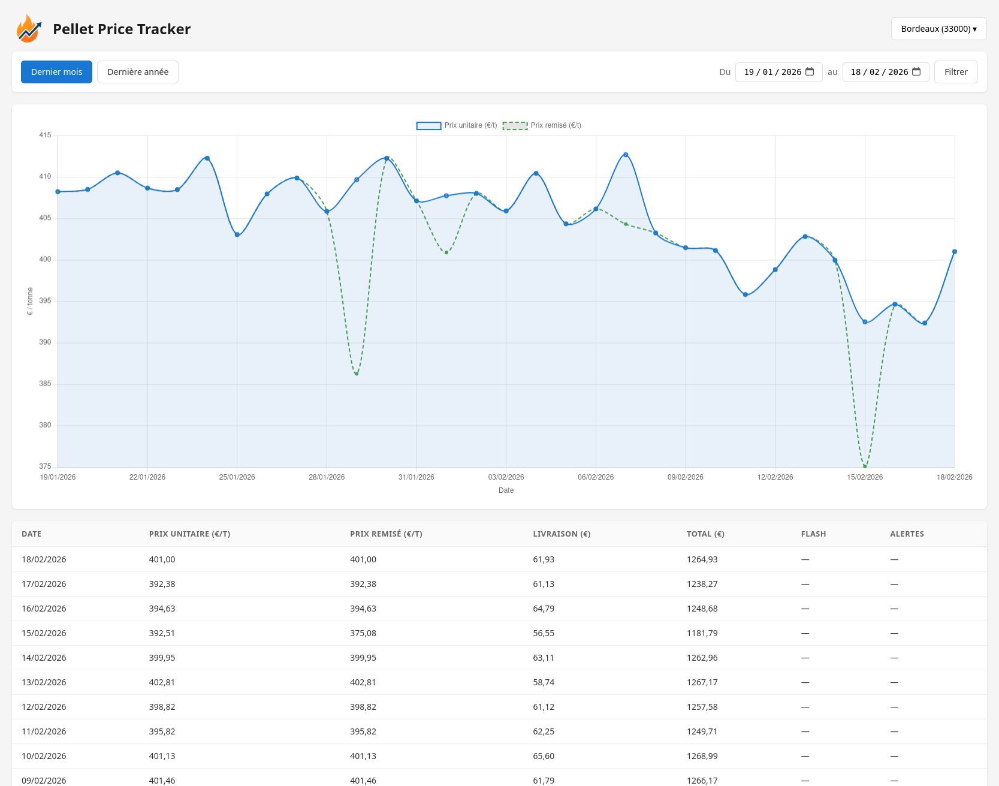

<p align="center">
  
</p>

<h1 align="center">Pellet Price Tracker</h1>

<p align="center">
  Daily crawler that fetches bulk wood pellet prices from the TotalEnergies API, stores price history in MariaDB, serves a web dashboard, and sends email alerts on price drops or active promotions.
</p>

<p align="center">
  <a href="https://github.com/helitik/pellet-price-tracker/actions/workflows/ci.yml"></a>
</p>

## Screenshot



## Features

- **Multi-town management** — Add, enable/disable, and delete towns via a modal with autocomplete search powered by the TotalEnergies API. An initial crawl runs automatically when a new town is added.
- **Daily price crawl** — Automatically fetches prices at a configurable time for all active towns.
- **Automatic retry** — On failure, retries every 15 minutes (up to 5 attempts within a 75-minute window).
- **Startup catch-up** — If today's crawl is missing at boot, it runs immediately.
- **Interactive dashboard** — Sortable table + Chart.js line chart with time filters (last month, last year, custom date range) and a town selector.
- **Email alerts** — Sends grouped HTML emails when:
  - Price hits a 6-month low
  - Price drops significantly vs. the 30-day average
  - An active discount is detected

  Alerts are event-based: an email is sent when a condition appears or the price drops further, not every day the condition still holds. If sending fails, the email is retried every 15 minutes for the rest of the day.
- **Healthcheck** — `GET /health` endpoint for container monitoring (Portainer, etc.)

## Tech Stack

| Component | Technology |
|-----------|-----------|
| Backend | Python 3.12, Flask, SQLAlchemy, APScheduler |
| Database | MariaDB 11 |
| Frontend | Vanilla JS, Chart.js 4 |
| Email | SMTP (Mailgun) |
| Deployment | Docker Compose |

## Getting Started

### Prerequisites

- Docker & Docker Compose

### Setup

1. Copy the environment file:

```bash
cp .env.example .env
```

2. Edit `.env` with your settings:

| Variable | Description | Default |
|----------|-------------|---------|
| `MYSQL_PASSWORD` | MariaDB user password | `changeme` |
| `MYSQL_ROOT_PASSWORD` | MariaDB root password | `changeme` |
| `CRAWL_HOUR` / `CRAWL_MINUTE` | Daily crawl time (Europe/Paris) | `8:00` |
| `CRAWL_PRODUCT_CATEGORY` | Product category (see table below) | `2` |
| `CRAWL_QUANTITY` | Quantity (unit depends on category, see table below) | `3` |
| `SMTP_HOST` / `SMTP_PORT` | SMTP server | `smtp.mailgun.org:587` |
| `SMTP_USER` / `SMTP_PASSWORD` | SMTP credentials | _(empty — alerts disabled)_ |
| `MAIL_FROM` / `MAIL_TO` | Sender and recipient addresses | — |
| `PRICE_DROP_THRESHOLD_PERCENT` | Alert threshold vs. 30-day avg | `5` |
| `FLASK_PORT` | Exposed dashboard port | `5000` |

**Product categories and quantity units:**

| ID | Category | Quantity unit |
|----|----------|---------------|
| 1 | Bagged pellets | Pallet of 66 bags |
| 2 | Bulk pellets | Tonne |
| 3 | Premium 40 cm logs | Pallet of 1.85 steres |
| 4 | Compressed wood logs | Pallet of 4 steres |

3. Launch:

```bash
docker compose up -d
```

The dashboard is available at `http://localhost:5000` (or whichever port you set via `FLASK_PORT`).

## Seed Data

To populate the database with 365 days of realistic price history (useful for development/demo):

```bash
docker compose exec app python -m app.main seed
```

This generates daily crawls for Bordeaux with seasonal price variations, occasional discounts, flash sales, and error days. Existing data is preserved (idempotent).

## Tests

Unit tests run on an in-memory SQLite database, no Docker or MariaDB needed:

```bash
pip install -r requirements-dev.txt
pytest
```

They cover alert detection, the event-based notification rules (one email per change, not per day), the retry of unsent emails, and the email content.

## API Endpoints

| Method | Endpoint | Description |
|--------|----------|-------------|
| `GET` | `/` | Dashboard (HTML) |
| `GET` | `/health` | Healthcheck (JSON) |
| `GET` | `/api/towns/search?query=...` | Search towns via TotalEnergies API |
| `POST` | `/api/towns` | Add a town (`{code, name}`) |
| `PATCH` | `/api/towns/<id>` | Enable/disable a town (`{active}`) |
| `DELETE` | `/api/towns/<id>` | Delete a town and all its data |

## Project Structure

```
├── docker-compose.yml
├── Dockerfile
├── .env.example
├── requirements.txt
├── app/
│   ├── main.py            # Entrypoint — Flask + APScheduler init
│   ├── config.py           # Environment-based configuration
│   ├── models.py           # SQLAlchemy models (Town, Crawl, Notification)
│   ├── crawler.py          # TotalEnergies API crawl logic + retry
│   ├── alerts.py           # Price alert detection + email sending
│   ├── seed.py             # Demo data generator (365 days)
│   ├── routes.py           # Flask routes (dashboard, API, healthcheck)
│   ├── static/
│   │   └── logo.png
│   └── templates/
│       └── dashboard.html
```

## License

This project is for personal use.
